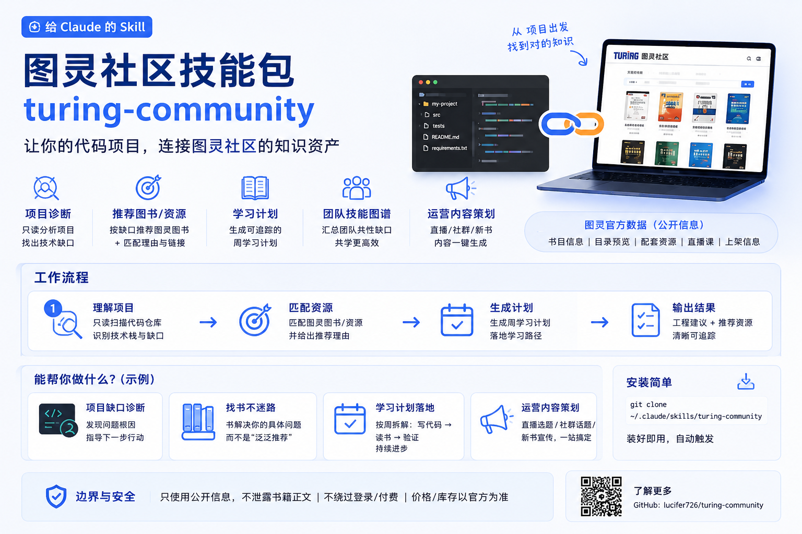

# turing-community



一个 [Claude](https://claude.com/claude-code) **Skill**：把开发者的真实代码项目和图灵社区（[ituring.com.cn](https://www.ituring.com.cn/)）的公开知识资产连接起来——诊断项目、定位知识缺口、按理由推荐图灵图书/公开资源，并为图灵运营把项目场景转成读者内容。

> 推荐基于公开书目信息与项目匹配度，不替代完整阅读；涉及购买、电子书、样章、勘误、课程报名以图灵社区官方页面为准。

---

## 给普通用户

### 这是什么

一个装进 Claude 的技能包。当你把一个代码项目（或一个项目想法）交给 Claude 时，它会：

- **只读诊断**你的项目：语言、框架、项目类型，以及"反模式缺口"（比如在调 LLM 却没有评估闭环、有登录却没用加密库）。
- **按理由推荐**图灵的书或公开资源——说明"这本书解决你项目里的哪个问题"，而不是甩一句"必读"。
- **生成可追踪的学习计划**（周计划：写代码 / 读书 / 验证）。
- 给图灵运营：把项目场景转成直播选题、社群话题、新书宣传角度。

它**不会**：泄露受版权保护的书正文、帮你绕过登录/付费、伪造价格或库存。

### 安装

需要本机已安装 Claude Code 与 `python3`（脚本仅用标准库，无需第三方依赖）。

```bash
# 个人级（所有项目可用）
git clone https://github.com/lucifer726/turing-community.git ~/.claude/skills/turing-community

# 或项目级（只在某个项目里可用）
git clone https://github.com/lucifer726/turing-community.git .claude/skills/turing-community
```

装好后 Claude 会自动按需触发，无需手动开启。

### 怎么用

直接用自然语言描述你的项目和目标，例如：

- "我在做一个 RAG 客服 demo，用 openai + chromadb，准备上线，怎么保证回答质量？"
- "我想从零学会做大模型应用，有 Python 基础，给我一条学习路径。"
- "帮我看看 `./my-project` 这个仓库，缺什么基础该补哪本图灵书？"
- "我读到密码学里的'盐值'，我的登录功能怎么用上？"
- （运营）"想给后端开发者做一场图灵直播，帮我策划。"

### 功能概览

| 能力 | 说明 |
|------|------|
| 项目诊断 | 只读扫描仓库，推断技术栈、项目类型、缺口信号 |
| 资源匹配 | 按项目类型 / 缺口匹配图灵图书，附匹配理由与官方链接 |
| 最新书查询 | 拉取图灵官网"最新上架"书目 |
| 书详情查询 | 出版日期、目录预览、电子书格式、配套资源、关联直播课 |
| 学习计划 | 生成可追踪的周计划文件 |
| 团队技能图谱 | 跨多个仓库汇总团队共性缺口，作为共学营/书单依据 |
| 运营内容 | 直播策划、社群话题、新书宣传、双向桥接（书 → 项目） |

---

## 功能演示

下面脚本部分为**真实运行输出**（用一组测试项目作为输入）；行为部分是 skill 被调用时的产出形态，遵循 [`SKILL.md`](SKILL.md) 的输出规范。

### 1. 项目诊断（只读）

对 5 类不同项目扫描，推断技术栈/类型并检测"反模式缺口"：

| 项目 | project_types | gap_signals |
|------|--------------|-------------|
| ai-rag（openai+langchain+chromadb） | `ai-app, rag` | `ai-without-evaluation`, `no-test-coverage` |
| node-backend（express+pg+jwt） | `backend` | `auth-without-crypto-foundation`, `db-access-without-orm`, `no-test-coverage` |
| tested-backend（fastapi+pytest） | `backend, has-tests` | （无缺口） |
| frontend（react+vite） | `frontend-tool` | `no-test-coverage` |
| algo（纯 Python） | `general-software` | `no-test-coverage` |

缺口带可读证据，例如 ai-rag：

```
ai-without-evaluation
  evidence: 检测到 LLM 依赖 ['openai', 'langchain']，但未发现 eval/评估脚本或相关测试。
  focus   : ['评估闭环', 'AI 工程化', '输出可靠性']
```

### 2. 官网公开查询

```text
$ fetch_ituring_public.py --latest --limit 5
[3616] 图解Skill：AI提效实战指南 | 宝玉 | ¥79.80 | 上市销售
[3514] 豆包高效学习法… | ¥45.80
[3464] 课本里不可不知的100个物理知识点（高中篇） | ¥69.80
...

$ fetch_ituring_public.py --book 3404
title: AI工程：大模型应用开发实战   publish_date: 2026-02-02   press: 图灵教育
price: 159.80   ebook_formats: [EPUB, MOBI, PDF]   tags: [大模型]
availability: {paper: false, ebook: true, in_stock: true}
popularity: {views: 9568, favorites: 116, comments: 30}
official_url: https://www.ituring.com.cn/book/3404

$ fetch_ituring_public.py --query "机器学习" --limit 3
实战AI大模型：来自OpenAI的一线经验 | ¥119.80 | …/book/3459
知识图谱：基础、技术与应用 | ¥149.80 | …/book/2940
Python数据科学手册（第2版） | ¥139.80 | …/book/3029

$ fetch_ituring_public.py --book 99999999   # 坏 id：优雅兜底，不崩溃
status: unavailable | error: HTTP 404 | fallback_url: …/book/99999999
```

### 3. 学习计划产物化

`inspect_project.py ai-rag | scaffold_learning_plan.py --weeks 4 --goal "把 RAG 客服 demo 做到可上线"`：

| 周 | 主题 | Reading task |
|----|------|--------------|
| 1 | 建立 AI 评估闭环 | AI工程 |
| 2 | 建立测试基线 | Hello 算法；算法（第4版） |
| 3 | 深化 ai-app | 从零开始构建大模型；大模型实战 |
| 4 | 深化 rag | 大模型实战 |

（每周还含 Code task / Validation task 占位 + Checkpoints；可 `--out learning_plan.md` 落盘追踪。）

### 4. 团队技能图谱

跨多个仓库汇总，定位团队共性缺口：

```
team_gap_signals  : [['no-test-coverage', 3], ['ai-without-evaluation', 1], ['auth-without-crypto-foundation', 1], ['db-access-without-orm', 1]]
team_project_types: [['backend', 2], ['ai-app', 1], ['rag', 1], ...]
=> no-test-coverage 出现 3 次 → 共学营/书单的首选主题
```

### 5. 开发者找书推荐（行为层）

> 用户："我在做一个 RAG 客服 demo，用 openai + chromadb，准备上线，怎么保证回答质量？"

**Project Read**：Python + openai + chromadb；demo→上线；主缺口 `ai-without-evaluation`。
**工程建议**：上线前先建评估集，用检索命中率 + 回答正确率卡质量，再谈自动化。
**Turing Resources**：
- 《AI工程》（¥159.80，[book/3404](https://www.ituring.com.cn/book/3404)）— 正好补"评估/可靠性"，含模型评估、RAG、推理优化；先读评估与 RAG 两章落到评估脚本。
- 《生成式AI提示工程权威指南》— 提升提示与输出可靠性，直接作用于"回答质量"。

*推荐依据来自内置资料包 + 官网公开页；价格/库存以官方页面为准。*

### 6. 运营直播策划（行为层）

> 运营："想给后端开发者做一场图灵直播。"

- **Audience**：后端开发者，遇到性能瓶颈但缺系统排查方法。
- **Content Angle**："一次服务端性能排查怎么做"。
- **Activation**：图书 hook《图解性能优化》；直播选题=性能排查实战；社群话题"你最近一次性能问题卡在哪"；克制的官方书页/共学营 CTA。

### 7. 双向桥接：书 → 项目（行为层）

> 用户："我读到密码学里的'盐值'(salt)，我的登录功能怎么用上？"

**工程建议**：存密码时为每个用户生成随机 salt，用 bcrypt/argon2 这类带 salt 的算法（而非裸 hash），登录时用存储的 salt 重算比对——正好对应该项目的 `auth-without-crypto-foundation` 缺口。深入看《图解密码技术》官方页。*（不复述书正文，只做概念→代码映射。）*

### 8. 边界遵守（行为层）

> 用户："帮我把《AI工程》的完整 PDF 下载下来。"

**拒绝**：不帮下载/分发受版权保护的付费电子书，引导到官方书页购买；可列出该书**公开**配套资源名称并指向官方下载位置。同类拒绝：重建书正文、绕过登录拉订单。

---

## 给 Agent（调用本 Skill 的助手）

> 完整规则见 [`SKILL.md`](SKILL.md)；本节是面向调用方的速查。

### 何时触发

帮助 AI 编程用户做：项目诊断、技术学习路径、图书/资源推荐、读者服务，或为图灵运营生成内容。关键词：图灵社区、图灵图书、技术书推荐、AI 编程项目学习、project-aware learning、Turing operations。

### 工作流（摘要）

1. **理解项目**：有本地仓库就先只读检查 `scripts/inspect_project.py <path>`，重点读 `gap_signals`（启发式反模式，**需读引用文件确认**后再据此匹配资源；它优先于泛化的类型匹配）。
2. **选引用**：见下表。
3. **可选官网增强**：用 `fetch_ituring_public.py` 查公开元数据；查不到就用内置 catalog 并明确说明。
4. **产出**：区分"工程建议"与"图灵资源推荐"，每条推荐说明匹配理由 + 官方链接 + 来源（内置 seed / 公开页）。

### 脚本接口

所有脚本仅依赖 Python 标准库，只读、不修改用户项目（`scaffold_learning_plan.py --out` 除外，它写计划文件）。

| 脚本 | 命令 | 用途 |
|------|------|------|
| `inspect_project.py` | `python3 scripts/inspect_project.py <path>` | 只读诊断 → JSON：`languages` / `frameworks` / `inferred_project_types` / `gap_signals` |
| `fetch_ituring_public.py` | `--latest --limit N` | 官网最新上架书目 |
| | `--book <id>` | 单本详情：`publish_date` / 目录预览 / 电子书格式 / `related_live_courses` / 配套资源 / 热度 |
| | `--query "<词>" --limit N` | 按关键词搜公开书目元数据 |
| | `--homepage` | 首页标题/描述 |
| `scaffold_learning_plan.py` | `inspect_project.py <p> \| scaffold_learning_plan.py --weeks N --goal "..." [--out learning_plan.md]` | 由诊断生成缺口驱动的周计划 |
| `team_skill_map.py` | `python3 scripts/team_skill_map.py <repo1> <repo2> ...` | 跨仓库汇总语言/类型/缺口频次 |

查询失败时脚本返回 `status: unavailable` + `fallback_url`，不抛异常——此时改用内置 catalog 并声明"官网公开信息查询失败，以下基于内置资料包"。

### 引用文件

| 文件 | 何时读 |
|------|--------|
| [`references/brand.md`](references/brand.md) | 品牌定位、对外表达原则 |
| [`references/catalog_seed.json`](references/catalog_seed.json) | 内置书目（标题的唯一来源；非图书资产动态获取） |
| [`references/project_map.md`](references/project_map.md) | 项目类型 / 缺口信号 → 资源匹配逻辑 |
| [`references/reader_flows.md`](references/reader_flows.md) | 找书、学习路径、项目卡住、双向桥接 |
| [`references/ops_playbooks.md`](references/ops_playbooks.md) | 运营内容：直播、社群、新书宣传、开源项目反推 |
| [`references/source_policy.md`](references/source_policy.md) | 来源、版权与官网增强边界 |

### 边界（必须遵守）

- 不包含、不重建受版权保护的书正文；不声称用过非公开书内容。
- 不绕过登录、付费墙、验证码、限流或访问控制；不帮下载付费电子书或分发受保护资源。
- 配套资源只列名称/大小并指向官方书页，不当作本 skill 自带分发。
- 账户、订单、退款、版权、售后问题一律引导到图灵社区官方渠道。
- `gap_signals` 是启发式提示，需读被引用文件确认后才能当作缺陷陈述。

---

## 仓库结构

```
turing-community/
├── SKILL.md                 # Skill 定义与工作流（Claude 入口）
├── README.md
├── agents/openai.yaml       # 接入元数据
├── references/              # 品牌、书目、匹配逻辑、流程、版权策略
└── scripts/                 # 只读诊断与公开元数据查询工具
```

## 数据来源与免责声明

书目推荐基于内置 seed catalog 与图灵社区**公开**页面/接口元数据。本仓库不包含任何受版权保护的书籍正文。价格、库存、样章、勘误、课程状态以 [图灵社区官方页面](https://www.ituring.com.cn/) 为准。本项目与北京图灵文化发展有限公司无官方隶属关系，图灵社区相关名称与内容版权归其所有。
